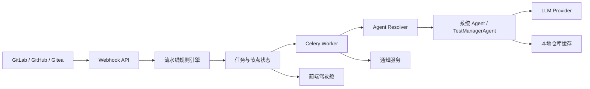
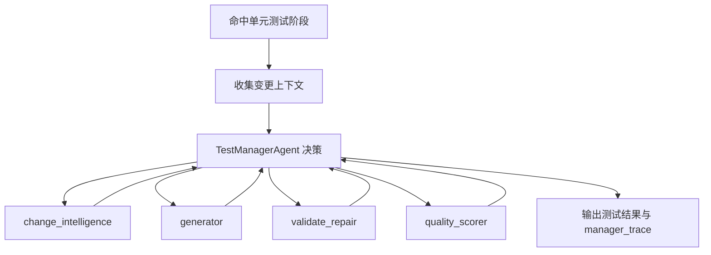

# AI DevOps 平台

AI DevOps 平台用于把 AI 能力接入代码研发流程，重点覆盖代码审查、单元测试生成、测试验证修复、质量评分、任务追踪和消息通知等场景。当前项目更适合先作为团队内部测试和能力验证平台使用，后续可逐步演进为面向多项目、多团队的 AI 研发治理系统。

## 当前定位

本项目不是 GitLab CI、GitHub Actions 或 Jenkins 的替代品，而是面向 AI 研发能力的编排层。

它负责：

- 接收 GitLab、GitHub、Gitea 等代码平台 WebHook。
- 根据仓库和分支规则决定本次任务要执行哪些阶段。
- 在不同阶段调用对应 Agent、模型、Skill 和工具。
- 记录流水线节点状态、Agent 执行日志、测试产物和通知结果。
- 为驾驶舱、任务日志、配置管理提供可视化入口。

它不负责：

- 替代代码平台原生 CI 的构建、部署和制品管理能力。
- 在所有场景中强制执行单元测试。
- 把代码审查和单元测试混合成同一个 Agent 内部步骤。

## 核心能力

- 多代码平台接入：支持 GitLab、GitHub、Gitea 仓库配置和 WebHook 接入。
- 模型配置：支持 OpenAI、DeepSeek、通义千问、智谱、Moonshot、Claude、OpenAI-Compatible、自定义模型等配置。
- 模型发现与验证：添加模型时可基于供应商和 Base URL 获取模型列表，并支持连通性测试。
- Agent 管理：内置系统 Agent，支持为不同阶段绑定模型、Skill Config、Model Config、Policy Config。
- 流水线规则：按仓库和分支匹配规则，决定执行代码审查、单元测试、构建、部署等阶段。
- 分支策略模板：支持 Git Flow、Trunk-Based、GitHub Flow、GitLab Flow 等快速模板。
- Agentic 单元测试：TestManagerAgent 作为单元测试域的 LLM 决策核心，观察变更上下文后决定调用哪些测试子能力。
- 任务驾驶舱：展示任务、流水线节点、执行日志、Agent 决策轨迹和失败原因。
- 通知配置：支持仓库级通知配置、任务事件通知、通知日志记录。

## 架构概览



### 当前关键边界

- 流水线规则决定执行哪些阶段。
- Agent 绑定决定某个阶段运行时使用哪个 Agent、模型和配置。
- 代码审查是流水线外层阶段，失败时会阻断后续阶段。
- TestManagerAgent 只负责单元测试域，不再直接执行代码审查。
- TestManagerAgent 可以读取 `code_review_result` 作为上下文，但不能把代码审查当作自己的 action。
- `validate_tests` 当前仍包含测试验证和修复闭环，后续可拆分为 `run_tests` 与 `repair_tests`。

## 技术栈

### 后端

- FastAPI
- SQLAlchemy
- Alembic
- PostgreSQL
- Redis
- Celery
- LiteLLM

### 前端

- React
- TypeScript
- Vite
- Ant Design
- React Router

### 部署

- Docker Compose
- API 服务：容器内 `8000`，宿主机 `8090`
- 前端服务：容器内 `3000`，宿主机 `3010`
- Flower：宿主机 `5555`
- PostgreSQL：宿主机 `5432`
- Redis：宿主机 `6379`
- Gitea：宿主机 `3001`

## 快速启动

> 本项目通过 Docker Compose 运行。不要在本地直接启动 `uvicorn`、`vite dev server` 等服务，否则容易造成端口冲突和运行状态不一致。

### 1. 配置环境变量

复制环境变量模板：

```bash
cp .env.example .env
```

按需配置：

```env
OPENAI_API_KEY=
DEEPSEEK_API_KEY=
QWEN_API_KEY=
ZHIPU_API_KEY=
MOONSHOT_API_KEY=
ANTHROPIC_API_KEY=
SECRET_KEY=
WEBHOOK_SECRET=
```

### 2. 启动服务

```bash
docker compose up -d --build
```

### 3. 查看服务状态

```bash
docker compose ps
```

### 4. 访问入口

- 前端控制台：http://localhost:3010
- 后端 API：http://localhost:8090
- Swagger 文档：http://localhost:8090/docs
- Flower：http://localhost:5555
- Gitea：http://localhost:3001

## 常用运维命令

重启全部服务：

```bash
docker compose restart
```

重启后端和 Worker：

```bash
docker compose restart api worker
```

重建前端：

```bash
docker compose up -d --build frontend
```

查看后端日志：

```bash
docker compose logs -f api
```

查看 Worker 日志：

```bash
docker compose logs -f worker
```

执行数据库迁移：

```bash
docker compose exec api alembic upgrade head
```

## 配置流程

### 1. 配置模型

入口：`配置管理 -> AI 模型`

建议流程：

1. 选择模型供应商。
2. 填写 API Key。
3. 填写或确认 Base URL。
4. 查询供应商支持的模型列表。
5. 选择一个或多个模型 ID。
6. 设置默认模型。
7. 点击测试按钮验证连通性。

注意：

- 模型 ID 为空或前缀为空时，不应自动拼接供应商前缀。
- OpenAI-Compatible 适合接入自建大模型、私有网关或兼容 OpenAI API 的推理服务。
- 如果供应商不提供模型列表接口，则前端应允许手动输入模型 ID。

### 2. 配置 Agent

入口：`配置管理 -> Agent 管理`

当前内置系统 Agent 包括：

- `code_review`：代码审查。
- `change_intelligence`：变更理解。
- `generator`：测试生成。
- `validate_repair`：测试验证与修复。
- `quality_scorer`：质量评分。

当前原则：

- 系统 Agent 的 `stage_type` 不允许被修改。
- 可调整模型绑定、Skill Config、Model Config、Policy Config 等配置。
- Agent 是专业能力单元，不建议在仓库配置阶段强制绑定。
- 仓库、分支、阶段的关系应由流水线规则决定。

### 3. 配置代码仓库

入口：`配置管理 -> 代码仓库`

需要填写：

- 仓库名称。
- 代码平台类型。
- 仓库地址。
- 默认分支。
- 访问令牌。
- WebHook Secret。

GitLab WebHook 示例：

```text
http://<你的平台 API 地址>:8090/webhook/gitlab
```

GitHub WebHook 示例：

```text
http://<你的平台 API 地址>:8090/webhook/github
```

Gitea WebHook 示例：

```text
http://<你的平台 API 地址>:8090/webhook/gitea
```

### 4. 配置流水线规则

入口：`配置管理 -> 流水线规则`

规则用于回答一个问题：当前仓库的当前分支命中后，要执行哪些阶段。

当前支持阶段：

- 代码审查。
- 单元测试。
- 自动合并。
- 构建。
- 部署。

分支策略模板：

- Git Flow。
- Trunk-Based。
- GitHub Flow。
- GitLab Flow。

如果某个项目只需要代码审查，不需要单元测试，应新增或调整规则，只勾选代码审查阶段。

### 5. 配置通知

入口：`配置管理 -> 通知配置`

当前通知配置重点支持：

- 飞书。
- 企业微信。
- 钉钉。
- Webhook。
- 邮件。

当前实现包含：

- `notify_configs`：通知通道配置。
- 仓库 `skills_config.notifications`：仓库级通知偏好。
- `notification_logs`：通知发送记录。

已删除或不再作为当前阶段重点：

- 独立 `notification_policies` 页面。
- 复杂通知策略管理模块。

后续建议方向：

- 按任务事件分类通知，例如开始、成功、失败、阻断、人工介入。
- 按仓库、分支、规则或阶段配置不同接收人。
- 保持通知策略轻量，不与单个 Agent 强绑定。

## Agentic 单元测试模块

当前单元测试模块的目标是：让 TestManagerAgent 成为单元测试域的决策核心，而不是固定脚本式流水线。

### 当前执行链路



### 当前已实现

- TestManagerAgent 使用 LLM 决策 action。
- 子 Agent 作为专业能力单元被调用。
- 支持 manager trace 记录决策过程。
- 支持 fallback，避免 LLM 决策不可用时任务完全不可执行。
- 代码审查结果可作为单元测试上下文输入。
- 代码审查不再属于 TestManagerAgent 内部 action。

### 当前边界和待演进项

- 子 Agent 接口仍需进一步统一。
- `validate_tests` 仍包含验证和修复闭环。
- SKILL.md 体系目前以本地 curated 扫描为主，尚未做配置化同步。
- 还需要真实 LLM 集成测试验证 Manager 决策稳定性。
- fallback 仍带固定顺序特征，是可用性兜底，不是最终智能路径。

## 任务与驾驶舱

入口：

- 驾驶舱：`/dashboard`
- 任务日志：`/logs/tasks`

重点查看：

- 任务状态。
- 流水线节点状态。
- 失败节点错误信息。
- Agent 执行日志。
- TestManager 决策轨迹。
- 通知发送记录。

失败阻断原则：

- 某一节点失败后，应标记当前节点为失败。
- 后续节点应被阻断或跳过。
- 不应把失败节点展示为成功。
- 相关失败通知应正常发送。

## 本地仓库缓存

Worker 会在本地缓存代码仓库，用于执行 `git show`、diff 分析、测试生成等操作。

缓存的存在是必要的，因为 WebHook 只提供事件信息，不包含完整仓库历史。

建议原则：

- 缓存目录应支持按仓库隔离。
- 执行任务前应 fetch 目标 commit。
- 当 `git show <sha>` 失败时，应尝试 fetch 对应分支或 commit。
- 后续需要补充缓存清理策略，例如按时间、容量或仓库数量清理。

## 开发验证

### 后端单元测试

```bash
docker compose exec api pytest
```

### 前端类型检查

```bash
docker compose exec frontend npm run type-check
```

### 前端构建

```bash
docker compose exec frontend npm run build
```

### 代码格式和差异检查

```bash
git diff --check
```

## 目录结构

```text
.
├── backend/
│   ├── app/
│   │   ├── api/                 # FastAPI 路由
│   │   ├── core/                # 配置、初始化、系统 Agent
│   │   ├── models/              # SQLAlchemy 模型
│   │   ├── services/            # 业务服务
│   │   └── tasks/               # Celery 任务
│   ├── alembic/                 # 数据库迁移
│   └── tests/                   # 后端测试
├── frontend/
│   └── src/
│       ├── components/          # 通用组件
│       ├── pages/               # 页面
│       └── services/            # API 客户端
├── docs/                        # 规格和设计文档
├── docker-compose.yml
└── README.md
```

## 当前阶段建议

短期建议：

- 继续保持仓库配置、流水线规则、Agent 配置三者边界清晰。
- 优先强化代码审查和单元测试两个核心 AI 场景。
- 保持通知策略轻量，先覆盖关键事件。
- 继续完善 TestManagerAgent 的决策轨迹、真实 LLM 测试和子 Agent 接口。

中期建议：

- 抽象单元测试模块，使其可独立接入 GitLab CI。
- 引入配置化 Skill Registry，支持组织内部 SkillsHub。
- 拆分测试验证和修复阶段。
- 增加并发执行、任务队列容量、仓库缓存清理和限流策略。

长期建议：

- 将平台演进为 AI 研发治理层。
- 将传统 CI 继续交给 GitLab CI、GitHub Actions、Jenkins 等成熟工具。
- 将本平台聚焦在 AI 审查、AI 测试、质量治理、知识沉淀和智能决策上。
